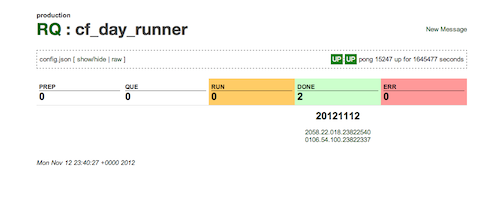

# RQ

RQ is a **simple**, reliable queueing/messaging system for *any* Unix system.
It can process queued messages in any computer language (lisp, ruby, bash, etc.).
It is designed to run on every machine in your distributed system.
Think of it as another one of those small, but important services (like crond).

RQ also has a simple periodic timer process that will inject a predefined
message into a queue. As a result, it is a good replacement for crond or atd.

RQ uses directories and json text files as its database.
As a result, it is easy to understand and debug.

Here is a sample screenshot of the web UI for a single queue:

